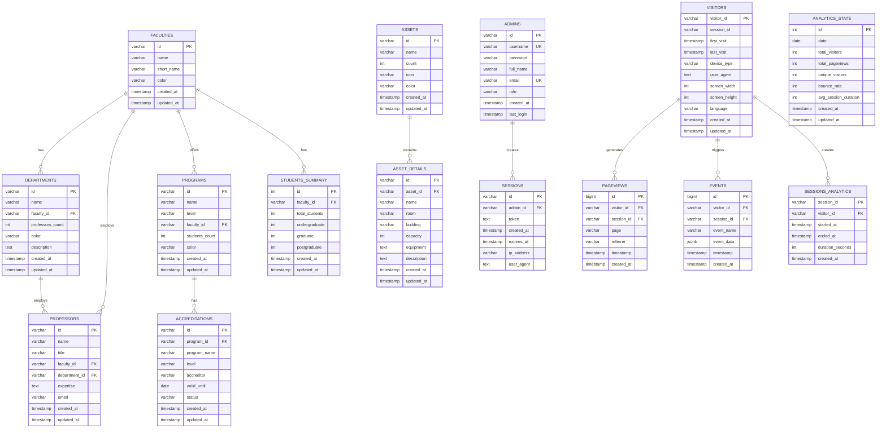

# Entity Relationship Diagram (ERD)
## Database Design untuk Dashboard Profile UPNVJ

## Diagram ERD



## Penjelasan Entitas

### 1. **FACULTIES** (Fakultas)
- Primary Key: `id`
- Merupakan entitas induk untuk departemen, program, dan profesor
- Relasi:
  - One-to-Many dengan DEPARTMENTS
  - One-to-Many dengan PROFESSORS
  - One-to-Many dengan PROGRAMS
  - One-to-Many dengan STUDENTS_SUMMARY

### 2. **DEPARTMENTS** (Departemen)
- Primary Key: `id`
- Foreign Key: `faculty_id` → FACULTIES
- Mengelompokkan profesor berdasarkan bidang keahlian
- Relasi:
  - Many-to-One dengan FACULTIES
  - One-to-Many dengan PROFESSORS

### 3. **PROFESSORS** (Dosen)
- Primary Key: `id`
- Foreign Keys:
  - `faculty_id` → FACULTIES
  - `department_id` → DEPARTMENTS (nullable)
- Field `expertise` akan disimpan sebagai TEXT (comma-separated atau JSON)

### 4. **PROGRAMS** (Program Studi)
- Primary Key: `id`
- Foreign Key: `faculty_id` → FACULTIES
- Menyimpan informasi program studi (S1, S2, S3, D3, dll)
- Relasi:
  - Many-to-One dengan FACULTIES
  - One-to-Many dengan ACCREDITATIONS

### 5. **ACCREDITATIONS** (Akreditasi)
- Primary Key: `id`
- Foreign Key: `program_id` → PROGRAMS (nullable, karena bisa juga menyimpan program_name)
- Menyimpan informasi akreditasi program

### 6. **STUDENTS_SUMMARY** (Ringkasan Mahasiswa)
- Primary Key: `id`
- Foreign Key: `faculty_id` → FACULTIES
- Menyimpan agregasi jumlah mahasiswa per fakultas

### 7. **ASSETS** (Kategori Aset)
- Primary Key: `id`
- Kategori aset seperti laboratorium, perpustakaan, dll
- Relasi:
  - One-to-Many dengan ASSET_DETAILS

### 8. **ASSET_DETAILS** (Detail Aset)
- Primary Key: `id`
- Foreign Key: `asset_id` → ASSETS
- Detail spesifik dari setiap aset
- Field `equipment` akan disimpan sebagai TEXT atau JSONB

### 9. **ADMINS** (Administrator)
- Primary Key: `id`
- Unique Keys: `username`, `email`
- Menyimpan informasi admin sistem
- Relasi:
  - One-to-Many dengan SESSIONS

### 10. **SESSIONS** (Sesi Admin)
- Primary Key: `id`
- Foreign Key: `admin_id` → ADMINS
- Menyimpan sesi login admin dengan JWT token

### 11. **VISITORS** (Pengunjung)
- Primary Key: `visitor_id`
- Menyimpan informasi unik pengunjung website
- Relasi:
  - One-to-Many dengan PAGEVIEWS
  - One-to-Many dengan EVENTS
  - One-to-Many dengan SESSIONS_ANALYTICS

### 12. **SESSIONS_ANALYTICS** (Sesi Analitik)
- Primary Key: `session_id`
- Foreign Key: `visitor_id` → VISITORS
- Menyimpan informasi sesi browsing pengunjung

### 13. **PAGEVIEWS** (Tampilan Halaman)
- Primary Key: `id` (auto-increment)
- Foreign Keys:
  - `visitor_id` → VISITORS
  - `session_id` → SESSIONS_ANALYTICS
- Menyimpan setiap kunjungan halaman

### 14. **EVENTS** (Event Analytics)
- Primary Key: `id` (auto-increment)
- Foreign Keys:
  - `visitor_id` → VISITORS
  - `session_id` → SESSIONS_ANALYTICS
- Menyimpan event seperti klik, perubahan bahasa, dll
- Field `event_data` menggunakan JSONB untuk fleksibilitas

### 15. **ANALYTICS_STATS** (Statistik Agregat)
- Primary Key: `id`
- Unique Key: `date`
- Menyimpan statistik harian yang sudah diagregasi
- Digunakan untuk performa query yang lebih cepat

## Indeks yang Direkomendasikan

```sql
-- Faculty & Department
CREATE INDEX idx_departments_faculty_id ON departments(faculty_id);
CREATE INDEX idx_professors_faculty_id ON professors(faculty_id);
CREATE INDEX idx_professors_department_id ON professors(department_id);
CREATE INDEX idx_programs_faculty_id ON programs(faculty_id);

-- Analytics
CREATE INDEX idx_pageviews_visitor_id ON pageviews(visitor_id);
CREATE INDEX idx_pageviews_session_id ON pageviews(session_id);
CREATE INDEX idx_pageviews_timestamp ON pageviews(timestamp);
CREATE INDEX idx_events_visitor_id ON events(visitor_id);
CREATE INDEX idx_events_session_id ON events(session_id);
CREATE INDEX idx_events_event_name ON events(event_name);
CREATE INDEX idx_events_timestamp ON events(timestamp);
CREATE INDEX idx_analytics_stats_date ON analytics_stats(date);

-- Admin & Sessions
CREATE INDEX idx_sessions_admin_id ON sessions(admin_id);
CREATE INDEX idx_sessions_expires_at ON sessions(expires_at);
```

## Normalisasi

Database ini dirancang dengan tingkat normalisasi:
- **3NF (Third Normal Form)** untuk sebagian besar tabel
- **Denormalisasi terkontrol** untuk:
  - `STUDENTS_SUMMARY` - agregasi data untuk performa
  - `ANALYTICS_STATS` - statistik yang sudah dihitung
  - `professors_count` di DEPARTMENTS - untuk menghindari COUNT query berulang

## Keuntungan Migrasi ke PostgreSQL

1. **Data Integrity**: Foreign keys dan constraints
2. **ACID Compliance**: Transaksi yang aman
3. **Performance**: Indexing dan query optimization
4. **Scalability**: Lebih mudah di-scale untuk data besar
5. **Advanced Features**: JSONB, Full-text search, Arrays
6. **Concurrent Access**: Multiple users dapat akses bersamaan
7. **Backup & Recovery**: Tools yang lebih robust
8. **Analytics**: Window functions dan advanced queries
