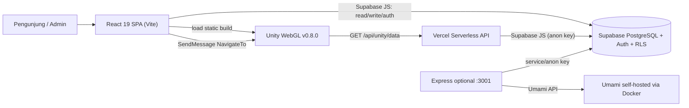

# AI Handoff — Dashboard Profile UPNVJ

> Snapshot: 21 Juli 2026 (WIB)  
> Commit yang diperiksa: `2eafda0851f256e85c7a6e07e4a88f33c42287a8` — `feat: upgrade Unity build to v0.8.0, remove all old builds`  
> Tujuan dokumen: memberi konteks operasional dan teknis yang cukup untuk AI/developer lain agar dapat melanjutkan pekerjaan tanpa perlu menebak arsitektur atau kontrak integrasi.

## 1. Ringkasan singkat

Project ini adalah dashboard profil Universitas Pembangunan Nasional Veteran Jakarta (UPNVJ). Pengunjung publik dapat melihat data kampus, fakultas/prodi, fasilitas, statistik traffic, serta memilih denah kampus **2D** atau tur **3D Unity WebGL**. Admin yang login melalui Supabase Auth dapat mengelola gedung, fasilitas, prodi, konfigurasi jalur denah 2D, audit log, dan melihat analytics.

Sumber data utama adalah **Supabase**. Frontend React berbicara langsung ke Supabase untuk hampir seluruh UI. Folder `api/` menyediakan endpoint Vercel read-only, terutama untuk Unity. Folder `server/` adalah Express server opsional untuk proxy Umami dan endpoint API lokal/mandiri; ia bukan jalur data frontend utama saat ini.



## 2. Batasan dan status repository

- Branch saat snapshot: `main`.
- Worktree bersih sebelum dokumen ini ditambahkan; tidak ada perubahan aplikasi yang dibuat sebagai bagian handoff.
- Unity build aktif adalah `public/unity-builds/v0.8.0/`. Aset binary utamanya: data ±73.3 MiB, WebAssembly ±6.2 MiB, loader ±115 KiB, framework ±71 KiB.
- Repository ini **bukan** full Unity project. Ia hanya menyimpan build WebGL dan script Unity referensi di `src/unity-scripts/`. PRD menyatakan Unity project asli berada di repository terpisah; perubahan scene, NavMesh, atau Starter Assets harus dilakukan di repo Unity tersebut lalu hasil build dipublikasikan ke folder di sini.
- Build WebGL 3D hanya diizinkan pada hosting non-GitHub Pages. UI sengaja menonaktifkan pilihan 3D di domain `*.github.io`; denah 2D tetap berfungsi.

## 3. Stack, dependensi, dan perintah kerja

| Area | Implementasi |
|---|---|
| Frontend | React 19 + TypeScript + Vite 7 + React Router 7 |
| Styling | Tailwind CSS 4, CSS aplikasi, Lucide, font Material lokal |
| Data/Auth | `@supabase/supabase-js` v2; Supabase PostgreSQL + Auth + RLS |
| Search | Fuse.js untuk pencarian tujuan navigasi 2D/3D; pencarian fasilitas publik juga query Supabase langsung |
| Charts | Recharts |
| 3D | Unity WebGL v0.8.0 dimuat melalui loader Unity native (tanpa paket `react-unity-webgl`) |
| API opsional | Vercel Functions di `api/`; Express 4 di `server/index.js` |
| Analytics | Implementasi UI aktif menghitung `web_analytics_log` dari Supabase; Express/Compose Umami masih ada sebagai jalur alternatif/legacy |
| Testing | Vitest + React Testing Library |

Gunakan `npm.cmd` pada Windows PowerShell bila execution policy memblokir `npm.ps1`.

```powershell
npm.cmd install
npm.cmd run dev          # Vite UI (biasanya http://localhost:5173)
npm.cmd run dev:api      # Express opsional (http://localhost:3001)
npm.cmd run dev:full     # keduanya dengan concurrently
npm.cmd test
npm.cmd run lint
npm.cmd run build
```

Hasil verifikasi snapshot:

- `npm.cmd run lint` — lulus.
- `npm.cmd test` — 12 test file, 118 test lulus.
- `npm.cmd run build` — lulus (`tsc -b && vite build`). Build mengeluarkan peringatan freshness `baseline-browser-mapping`/`caniuse-lite`, bukan error proyek.

## 4. Struktur direktori yang penting

```text
src/
  App.tsx                         # provider tree, router, lazy routes, Unity preload
  contexts/                       # auth, language, dashboard cache, toast
  components/
    dashboard/                    # halaman publik dan bagian hero/aset/map/tutorial
    campus-map/                   # map chooser, 2D, Unity loader, overlay search
    admin/                        # dashboard admin, tabel CRUD, editor denah 2D
    analytics/                    # page-view tracker dan chart publik
    auth/                         # login
    common/                       # header/footer/protected route/error boundary
    modals/                       # CRUD dan detail/konfirmasi
  services/
    api/supabaseDataService.ts    # read dashboard + CRUD gedung/fasilitas/prodi
    auth/                         # adapter Supabase Auth
    analytics/                    # tracker dan agregasi Supabase
    campusMapService.ts           # CRUD konfigurasi map 2D
  lib/supabase.ts                 # satu client Supabase browser
  hooks/useBuildingSearch.ts      # search gedung/fasilitas untuk map
  utils/                          # retry, i18n, preloader Unity, A* map, dll.
  unity-scripts/                  # script C#/.jslib yang harus disalin/sinkron ke repo Unity

api/                              # Vercel functions GET read-only
server/index.js                   # Express API + Umami proxy (opsional)
database/                         # full setup, seed, denah 2D migration/seed
public/unity-builds/v0.8.0/       # Unity WebGL release aktif
docs/                             # audit, QA/UAT, deployment, history, dokumen ini
```

File awal yang paling efektif dibaca oleh AI penerus: `PRD.md`, dokumen ini, `src/App.tsx`, `src/services/api/supabaseDataService.ts`, `src/components/campus-map/CampusMapViewer.tsx`, `src/components/campus-map/UnityCampusMap.tsx`, `src/services/campusMapService.ts`, `database/001_full_setup.sql`, dan `api/unity/data.js`.

## 5. Routing dan state aplikasi

| Route | Akses | Isi |
|---|---|---|
| `/` | publik | `DashboardProvider`, Header, Dashboard, Footer |
| `/login`, `/admin/login` | publik | halaman login Supabase |
| `/admin` | harus ada sesi Supabase | panel admin melalui `ProtectedRoute` |
| `*` | publik | halaman 404 sederhana |

Provider dibungkus di `src/App.tsx` dengan urutan `LanguageProvider → AuthProvider → ToastProvider → Router`. `DashboardProvider` sengaja hanya membungkus rute `/` supaya data publik tidak dimuat di halaman admin.

- `LanguageContext`: bahasa `id` / `en`, disimpan pada `localStorage` key `upnvj-language`, memakai kamus lokal `src/utils/translations.ts`.
- `AuthContext`: mengubah username yang diisi pengguna menjadi email `${username}@admin.upnvj.ac.id`, lalu memakai password auth Supabase. Profil tambahan dicoba dari `admin_users` berdasarkan username.
- `DashboardContext`: melakukan `Promise.all(fetchDashboardData(), fetchFaculties())`, menjaga `loading`, `error`, dan fungsi `reload`.
- `ToastContext`: feedback UI global.

Dashboard publik mencakup hero carousel, data/aset dan modal fasilitas, traffic chart, kartu denah, pemilih mode map, dan tutorial/FAQ. Komponen berat di bawah fold dimuat dengan `React.lazy`.

Panel admin mempunyai tab: `buildings`, `assets`, `programs`, `campus-map`, `analytics`, dan `audit`. Operasi CRUD gedung/fasilitas/prodi memakai modal validasi + modal konfirmasi hapus. Editor denah 2D memiliki mode marker gedung, entrance, node path, connect edge, dan delete.

## 6. Database dan model data

Jalankan SQL di Supabase SQL Editor dengan urutan berikut bila menyiapkan database baru:

1. `database/001_full_setup.sql` — reset policy/table terkait, schema lengkap, index dan RLS.
2. `database/002_seed_data.sql` — seed data Pondok Labu.
3. `database/003_campus_map_2d.sql` — schema tambahan denah 2D (perlu untuk database lama; schema itu juga sudah terintegrasi pada `001`).
4. `database/004_campus_map_config_seed.sql` — 63 node, 96 edge, dan pointer gedung untuk `pondok-labu-2d`.
5. `database/005_update_campus_map_background.sql` — patch background database lama bila dibutuhkan.

### Tabel dan relasi

| Tabel | Fungsi / kolom penting |
|---|---|
| `gedung` | master bangunan; `nama_gedung`, lokasi, lantai, foto, **`unity_object_name` unique** |
| `fasilitas` | fasilitas/ruang; FK `id_gedung`, lantai, type/color/foto, **`unity_object_name` unique** |
| `fakultas` | metadata fakultas; FK opsional gedung utama |
| `program_studi` | prodi + jenjang + akreditasi; FK fakultas |
| `admin_users` | profil tambahan admin lama (`username`, `password_hash`, role); bukan pengganti Supabase Auth |
| `web_analytics_log` | event page view (`visitor_hash`, path, device, timestamp) yang kini dibaca UI analytics |
| `audit_logs` | actor UUID/email, aksi, tabel, record, JSON lama/baru |
| `campus_maps` | metadata gambar dan satu map aktif |
| `campus_map_nodes` | titik ter-normalisasi 0..1; type `path`, `building_entrance`, `gate` |
| `campus_map_edges` | graph antar node; arah, aksesibilitas, optional cost |
| `campus_map_building_points` | marker gedung dan node entrance; unique per map/gedung |

Relasi inti:

```text
fakultas.id_gedung_utama ──> gedung.id
fasilitas.id_gedung ───────> gedung.id
program_studi.id_fakultas ─> fakultas.id
campus_map_building_points.gedung_id ─> gedung.id
campus_map_nodes/edges/building_points.map_id ─> campus_maps.id
```

`unity_object_name` adalah kontrak paling sensitif: nilainya harus cocok dengan nama `GameObject` di Unity (case-insensitive pada `NavigationReceiver`, tetapi tetap gunakan exact/canonical name). Untuk fasilitas, field boleh kosong; search akan fallback ke `unity_object_name` gedung induknya sehingga navigasi tetap mengarah ke gedung.

### RLS saat ini

Schema memberi `anon` hak SELECT pada data kampus/map serta insert pada `web_analytics_log`. Role `authenticated` diberi SELECT/INSERT/UPDATE/DELETE untuk data pengelolaan dan map; `audit_logs` hanya authenticated select/insert. Ini efektif bila hanya admin yang dapat memperoleh sesi Supabase, tetapi bukan role authorization granular: **user Supabase mana pun yang authenticated secara teknis mendapat hak mutasi**. Jangan menganggap pemeriksaan `ProtectedRoute` sebagai kontrol keamanan database.

## 7. Kontrak integrasi dan code snippet

Bagian ini adalah sumber kebenaran praktis untuk komunikasi frontend, backend, database, dan Unity. Snippet disederhanakan dari implementasi repository saat snapshot tanpa memuat credential.

### 7.1 Frontend React ↔ Supabase (jalur utama)

Browser membuat satu Supabase client dari environment Vite. Hanya `VITE_*` yang boleh dipakai browser; jangan pernah menaruh service-role key di source frontend.

```ts
// src/lib/supabase.ts
import { createClient } from "@supabase/supabase-js";
import { env } from "../utils/env";

export const supabase = createClient(
  env.VITE_SUPABASE_URL,
  env.VITE_SUPABASE_ANON_KEY,
  { auth: { persistSession: true, autoRefreshToken: true, detectSessionInUrl: true } },
);
```

Contoh UI yang memuat graph denah 2D secara langsung dari Supabase. Ini **bukan** melalui Express atau `/api/*`.

```ts
// src/services/campusMapService.ts
const { data: mapRow, error: mapError } = await supabase
  .from("campus_maps")
  .select("id,nama,image_url,image_width,image_height")
  .eq("is_active", true)
  .limit(1)
  .maybeSingle();

const [nodesResult, edgesResult, pointsResult, buildingsResult] = await Promise.all([
  supabase.from("campus_map_nodes").select("id,map_id,label,node_type,x,y").eq("map_id", map.id),
  supabase.from("campus_map_edges").select("id,map_id,from_node_id,to_node_id,bidirectional,accessible,weight").eq("map_id", map.id),
  supabase.from("campus_map_building_points").select("id,map_id,gedung_id,marker_x,marker_y,entrance_node_id").eq("map_id", map.id),
  supabase.from("gedung").select("id,nama_gedung"),
]);
```

Contoh mutasi admin (marker map) juga langsung melalui client browser dan tunduk pada RLS:

```ts
// src/services/campusMapService.ts
await supabase.from("campus_map_building_points").upsert(
  { map_id: mapId, gedung_id: buildingId, marker_x: x, marker_y: y },
  { onConflict: "map_id,gedung_id" },
);
```

Data dashboard publik melalui `fetchDashboardData()` di `supabaseDataService.ts`. Service tersebut menggabungkan tabel `program_studi`/`fakultas` dan `fasilitas`/`gedung`, memetakan ke type presentasi, lalu menyimpannya pada cache module-level sampai `clearCache()` dipanggil setelah CRUD.

### 7.2 Frontend React ↔ Supabase Auth

Login berbasis Supabase Auth; tabel `admin_users` hanya menambah username/nama/role untuk UI.

```ts
// src/contexts/AuthContext.tsx (alur inti)
const email = `${username}@admin.upnvj.ac.id`;
const { session, user, error } = await authAdapter.signInWithPassword(email, password);

const { data: profileData } = await supabase
  .from("admin_users")
  .select("id, username, nama_lengkap, role")
  .eq("username", username)
  .single();
```

Prasyarat operasional: akun Supabase Auth harus mempunyai email dengan pola di atas. Jika profil `admin_users` tidak ada, login masih dapat membuat state admin dari metadata Auth, tetapi CRUD tetap bergantung pada RLS authenticated.

### 7.3 React ↔ Unity WebGL

React memuat build static Unity v0.8.0 sendiri, lalu mengekspos instansinya pada `window.unityInstance`. Tidak ada dependency `react-unity-webgl` di `package.json` walaupun PRD lama pernah menyebutnya.

```ts
// src/components/campus-map/UnityCampusMap.tsx
const unityConfig = {
  dataUrl: `${basePath}unity-builds/v0.8.0/Build/v0.8.0.data.unityweb`,
  frameworkUrl: `${basePath}unity-builds/v0.8.0/Build/v0.8.0.framework.js.unityweb`,
  codeUrl: `${basePath}unity-builds/v0.8.0/Build/v0.8.0.wasm.unityweb`,
  streamingAssetsUrl: "StreamingAssets",
  productVersion: "v0.8.0",
  devicePixelRatio: Math.min(window.devicePixelRatio || 1, 2),
};

const instance = await window.createUnityInstance(canvas, configWithProgress, configWithProgress.onProgress);
window.unityInstance = instance;
instance.SendMessage("WebPlatformSync", "SetDevice", isMobile ? "mobile" : "desktop");
```

Search overlay menjalankan fuzzy search dari data gedung/fasilitas yang diambil langsung dari Supabase. Ketika user memilih hasil pada mode 3D, frontend mengirim **`unityObjectName`**, bukan label yang tampil, ke GameObject Unity bernama `NavigationReceiver`.

```ts
// src/components/campus-map/SearchOverlay.tsx
window.unityInstance.SendMessage(
  "NavigationReceiver", // nama GameObject di Unity scene
  "NavigateTo",         // method public C#
  item.unityObjectName,  // gedung.unity_object_name / fasilitas fallback
);

// membatalkan rute
window.unityInstance.SendMessage("NavigationReceiver", "StopNavigation", "");
```

Kontrak hasil pencarian:

```ts
type SearchResult = {
  label: string;                  // nama untuk UI
  sublabel?: string;              // gedung induk fasilitas
  unityObjectName: string;        // payload Unity
  buildingId: number;             // target denah 2D
  type: "gedung" | "fasilitas";
};
```

Untuk map 2D, callback `onNavigate` tidak memanggil Unity. Ia menggunakan `buildingId` sebagai tujuan, lalu menjalankan A* `findCampusRoute(nodes, edges, startEntranceId, destinationEntranceId)` dan menggambar SVG polyline di atas gambar denah.

### 7.4 Unity WebGL ↔ Vercel API ↔ Supabase

Saat startup, `BuildingDatabase.cs` mengambil daftar bangunan/fasilitas supaya Unity memiliki daftar object valid serta nama tampilan. Pada build WebGL, endpoint dipaksa ke relative URL agar mengikuti domain aplikasi saat ini:

```csharp
// src/unity-scripts/BuildingDatabase.cs
public string apiEndpoint = "http://localhost:3000/api/unity/data";

private void Awake()
{
    apiEndpoint = "https://dashboard-profile-upnvj.vercel.app/api/unity/data";
}

public IEnumerator LoadDatabaseFromApi()
{
    string url = apiEndpoint;
#if !UNITY_EDITOR && UNITY_WEBGL
    url = "/api/unity/data";
#endif
    using (UnityWebRequest request = UnityWebRequest.Get(url))
    {
        yield return request.SendWebRequest();
        if (request.result == UnityWebRequest.Result.Success)
            ParseJsonData(request.downloadHandler.text);
    }
}
```

Endpoint Vercel berikut membaca dua tabel menggunakan anon key, membentuk JSON yang sesuai `UnityApiResponse`, lalu Unity mengisi `unityObjectNames` dan dictionary nama display:

```js
// api/unity/data.js
const [gedungResult, fasilitasResult] = await Promise.all([
  supabase.from("gedung")
    .select("id, nama_gedung, deskripsi_gedung, lokasi, jumlah_lantai, unity_object_name")
    .order("id", { ascending: true }),
  supabase.from("fasilitas")
    .select("id, nama_fasilitas, deskripsi_fasilitas, tipe_fasilitas, id_gedung, lantai, foto_url, unity_object_name")
    .order("id_gedung", { ascending: true })
    .order("lantai", { ascending: true }),
]);

return res.status(200).json({
  gedung: gedungResult.data || [],
  fasilitas: fasilitasResult.data || [],
});
```

Di Unity, `NavigationReceiver.NavigateTo` mencari `GameObject` berdasarkan `unity_object_name`, lalu mengoper `Transform` dan nama display kepada `NavigationGuide` yang menghitung NavMesh path dan menggambar `LineRenderer`.

```csharp
// src/unity-scripts/NavigationReceiver.cs
public void NavigateTo(string unityObjectName)
{
    string key = unityObjectName.Trim().ToLower();
    string displayName = database != null ? database.GetRealName(unityObjectName) : unityObjectName;

    if (buildingCache.TryGetValue(key, out Transform target))
        navigationGuide.StartNavigation(target, displayName);
    else
        BuildCache(); // lalu retry dan fallback direct scene search
}
```

Unity dapat mengirim event kembali ke React melalui plugin `ReactBridge.jslib`. Kontrak completion terbaru memakai event `OnNavigationCompleted` dengan `CustomEvent.detail` berupa string JSON:

```json
{"unity_object_name":"yos_sudarso"}
```

`SearchOverlay` memasang listener dengan cleanup, mem-parse payload, lalu menormalisasi `payload.unity_object_name` dan `selectedItem.unityObjectName` menggunakan `trim().toLowerCase()`. Popup kedatangan hanya ditampilkan ketika navigasi masih aktif dan kedua key sama. Payload kosong/rusak, target berbeda, state tanpa selected item, serta event setelah cancel diabaikan. Unity wajib mengirim event hanya dari completion normal; cancel, pergantian spawn, dan target yang tidak ditemukan tidak boleh mengirim completion event.

Detail implementasi dan checklist integrasi tersedia di `docs/handoff-navigation-completion-event.md`.

### 7.5 Endpoint Vercel yang tersedia

Semua endpoint di folder `api/` hanya mendukung GET/OPTIONS dan secara eksplisit mengatur CORS `*` untuk kebutuhan Unity/cross-origin. Mereka menggunakan `VITE_SUPABASE_URL` dan `VITE_SUPABASE_ANON_KEY` pada environment deployment.

| Endpoint | Response / konsumen utama |
|---|---|
| `GET /api/health` | envelope `{ success, data: {status, message}, timestamp }` untuk health check |
| `GET /api/rooms` | daftar fasilitas dengan gedung |
| `GET /api/rooms/:id` | satu fasilitas |
| `GET /api/buildings` | gedung + nested facilities |
| `GET /api/buildings/:id/rooms` | fasilitas pada gedung |
| `GET /api/unity/names?type=gedung|fasilitas` | `{ unityObjectNames: string[] }`, terutama Editor `DatabaseSyncChecker` |
| `GET /api/unity/data` | raw `{ gedung: [], fasilitas: [] }`, runtime `BuildingDatabase` |

Catatan: React UI saat ini tidak terbukti memakai `/api/rooms` atau `/api/buildings`; ia query Supabase langsung. Endpoint tersebut dipertahankan untuk Unity, integrator eksternal, dan kompatibilitas.

### 7.6 Express + Umami (jalur opsional)

`server/index.js` berjalan di port `3001`, memasang CORS origin whitelist dan in-memory rate limit 100 request/IP/menit. Ia mengulang endpoint read-only rooms/buildings/unity, lalu memiliki `/api/analytics/*` untuk proxy Umami (`stats`, `pageviews`, `active`, `metrics`, `events`, `summary`). Ia menggunakan `SUPABASE_SERVICE_ROLE_KEY` bila tersedia, fallback ke anon key.

`docker-compose.yml` hanya menyalakan Umami + PostgreSQL Umami, bukan aplikasi dashboard. Jangan menjalankannya di production tanpa mengganti nilai default `UMAMI_DB_PASSWORD` dan `UMAMI_APP_SECRET`.

Implementasi frontend analytics saat ini lebih baru: `trackingService.ts` insert event langsung ke `web_analytics_log`, dan file yang bernama `umamiService.ts` sekarang menghitung agregat dari tabel Supabase itu. Dengan demikian deployment React normal tidak memerlukan Express atau Umami agar chart berfungsi.

## 8. Detail denah 2D dan 3D

### Denah 2D

1. `CampusMapViewer` pertama menampilkan chooser 2D/3D.
2. `CampusMap2D` mengambil map yang `is_active = true` dari Supabase.
3. User wajib memilih gedung awal yang mempunyai `entrance_node_id`.
4. Search memakai `useBuildingSearch`; fasilitas diarahkan ke `buildingId` gedung induknya.
5. `findCampusRoute` menjalankan A* dengan edge yang `accessible = true`, memakai `weight` jika ada atau jarak koordinat image sebagai cost.
6. SVG menampilkan gambar map, marker gedung, dan path hijau-putus-putus.

Kegagalan yang di-handle UI: map belum dikonfigurasi, gagal load, marker/entrance tujuan hilang, user sudah berada di gedung tujuan, serta graph tidak terhubung. Editor admin harus digunakan bila node/edge/marker berubah.

### Denah 3D

1. `App` memanggil `scheduleUnityPreload(10000)` setelah halaman stabil. Preload mengunduh sequential loader/framework/wasm/data dengan priority rendah.
2. Preload otomatis di-skip untuk mobile, `Save-Data`, jaringan 2G/slow-2G, dan GitHub Pages; tetapi user desktop masih dapat memulai 3D lewat tombol map.
3. `UnityCampusMap` mengecek WebGL, memuat loader script, menjalankan `createUnityInstance`, memperlihatkan progress/error/fallback, dan destroy instance lewat `Quit()` pada unmount.
4. `unityKeyboardPatch.ts` memonkey-patch event listener dan pointer lock agar input React overlay tidak direbut Unity. Karena ini perubahan global browser, komponen map dipisah/lazy-load agar tidak memengaruhi initial load.
5. Unity `BuildingDatabase` fetch API data; `NavigationReceiver` membangun cache name→Transform; `NavigationGuide` memakai `NavMesh.CalculatePath`, menghaluskan line, menghitung jarak, dan stop ketika <= `stopDistance`.

Konfigurasi Unity yang wajib disinkronkan di scene Unity asli:

- GameObject bernama `NavigationReceiver` memiliki reference `BuildingDatabase` dan `NavigationGuide`.
- GameObject `WebPlatformSync` memiliki method public `SetDevice`.
- GameObject tujuan harus cocok dengan `unity_object_name` database.
- `NavigationGuide` harus diassign player, LineRenderer, prefab teks, NavMesh yang sudah bake, serta layer ground yang benar.
- `DatabaseSyncChecker` Editor dapat membandingkan nama API dari `/api/unity/names` dengan object di scene sebelum membuat build baru.

## 9. Konfigurasi, hosting, dan keamanan deployment

### Environment

Salin `.env.example` ke `.env`. Nilai yang diperlukan browser:

```env
VITE_SUPABASE_URL=https://<project>.supabase.co
VITE_SUPABASE_ANON_KEY=<anon-public-key>
```

Nilai Express tambahan (jangan dibundle ke frontend):

```env
SUPABASE_URL=https://<project>.supabase.co
SUPABASE_SERVICE_ROLE_KEY=<server-only-secret>
PORT=3001
FRONTEND_URL=http://localhost:5173
UMAMI_API_URL=http://localhost:3000
UMAMI_WEBSITE_ID=<uuid>
UMAMI_API_USER=<user>
UMAMI_API_PASSWORD=<password>
UMAMI_APP_SECRET=<secret>
```

### Hosting

- `vercel.json` mengatur rewrite SPA dan header Brotli serta cache immutable untuk `unity-builds/v0.8.0/Build/*`. Ini hosting yang sesuai untuk 3D + Vercel API.
- `.github/workflows/deploy.yml` membangun dan deploy `main` ke GitHub Pages. Karena hosting Pages tidak diperlakukan cukup untuk header Brotli, UI hanya menawarkan 2D di sana.
- `vite.config.ts` menetapkan `base: '/'`, manual vendor chunks, target ES2020, dan middleware dev untuk header file Unity `.brbin` lama. Build saat ini memakai `.unityweb` dan deployment Vercel yang relevan.

Jangan commit `.env`, service-role key, password Umami, atau output credential. Anon key memang public by design tetapi tetap harus dipasangkan dengan RLS yang benar.

## 10. Observasi penting, debt, dan dokumentasi yang sudah stale

Ini bukan daftar bug yang sudah direproduksi; ini temuan yang perlu dibaca AI penerus sebelum mengubah modul terkait.

1. **Dokumen lama tidak selalu mencerminkan source terbaru.** `README.md` dan bagian PRD lama menyebut komponen/arsitektur yang sudah berubah (misalnya `react-unity-webgl`, Umami sebagai jalur analytics aktif, dan jumlah tabel lama). Prioritaskan source + `database/001_full_setup.sql` + dokumen ini.
2. **Analitik sedang dalam masa transisi.** SQL memberi komentar bahwa `web_analytics_log` legacy/digantikan Umami, namun `trackingService.ts` dan `umamiService.ts` aktif memakai tabel tersebut. Jangan menghapus tabel atau Express/Umami sebelum memilih satu strategi dan memperbarui UI/dokumen.
3. **Dua jalur API ada bersamaan.** Frontend direct Supabase, Vercel Functions, dan Express duplicate banyak read endpoint. Pilih contract yang jelas sebelum menambah endpoint baru agar tidak menambah dual data path.
4. **Auth dan authorization berbeda.** UI admin hanya mengecek sesi. RLS memberi semua authenticated user mutation rights. Jika requirement-nya hanya admin kampus, perkuat policy berbasis custom claim/role server-side atau tabel allow-list yang diverifikasi SQL, bukan hanya `user_metadata`/React.
5. **`admin_users.password_hash` tidak dipakai untuk login current.** Supabase Auth menangani password. Menjaga dua sumber kredensial dapat membingungkan; jangan menyinkronkan/mengisi password hash sembarang tanpa keputusan desain.
6. **Audit log dibuat di aplikasi, bukan trigger database yang terlihat pada schema ini.** `supabaseDataService.ts` memanggil `logCreate`/`logUpdate`/`logDelete`. PRD yang mengatakan trigger otomatis tidak didukung oleh `001_full_setup.sql` saat snapshot (tidak ada `CREATE TRIGGER`). Mutasi di luar frontend dapat lolos dari audit.
7. **Type declaration Supabase di `src/lib/supabase.ts` sudah ketinggalan dari schema.** Ia menyebut tabel lama seperti `akreditasi`, `dosen`, `mahasiswa`, dan tidak merepresentasikan semua field/table map terbaru. Client tidak diparameterkan dengan type itu sehingga runtime tidak terdampak, tetapi regenerasi type dari schema akan mengurangi drift.
8. **Unity contract adalah lintas repository.** Mengganti `unity_object_name`, rename GameObject, atau mengganti version folder perlu perubahan terkoordinasi: seed/database → API → Unity scene/build → React loader/preloader → Vercel cache/header. Lakukan `DatabaseSyncChecker` sebelum release.
9. **`BuildingDatabase.Awake()` menyetel domain Vercel hard-coded, sedangkan WebGL runtime lalu memilih `/api/unity/data`.** Editor/non-WebGL dapat tetap memakai Vercel hard-coded, WebGL mengikuti origin. Jika backend di-domain lain, putuskan apakah perlu configuration asset atau absolute runtime URL; jangan hanya mengubah satu branch.
10. **Map 2D sepenuhnya tergantung seed/config database.** Bila migration 003/004 belum dijalankan atau active map tidak ada, UI memberi fallback “belum dikonfigurasi”; itu bukan kerusakan React.
11. **Tidak ada test browser end-to-end/Unity integration dalam suite yang dijalankan.** Test unit kuat untuk utility/auth adapter/modal, tetapi validasi Supabase RLS, API deployment headers, map data nyata, dan Unity path perlu manual/black-box/UAT. Lihat `docs/testing-plan-blackbox-uat.md`.
12. **Dokumen audit lama menandai beberapa masalah yang tampaknya sudah sebagian diperbaiki** (lazy loading, memoized provider, rate limiter). Perlakukan audit sebagai sejarah/risk checklist, lalu verifikasi terhadap source sebelum menjadwalkan work.

## 11. Checklist perubahan umum

### Menambah gedung/fasilitas yang juga bisa dinavigasi 3D

1. CRUD data di admin/Supabase; isi `unity_object_name` canonical yang unik.
2. Buat/rename GameObject yang cocok dalam Unity project asli.
3. Pastikan object bisa dicapai NavMesh dan setting `NavigationGuide` sesuai.
4. Jalankan `DatabaseSyncChecker` di Unity Editor terhadap deployment API yang tepat.
5. Build Unity baru ke folder version baru, misalnya `public/unity-builds/v0.8.1/`.
6. Ubah **semua** string version di `UnityCampusMap.tsx`, `unityPreloader.ts`, `vercel.json`, dan dokumentasi/tutorial bila perlu.
7. Tes API `/api/unity/data`, search React, `SendMessage`, route/stop, loading, dan cache pada browser target.

### Mengubah map 2D

1. Pastikan `campus_maps` active dan background asset tersedia di `public/maps/`.
2. Via tab Campus Map admin: set marker tiap gedung, tambah entrance, tambah node jalan, hubungkan edges.
3. Pastikan semua gedung yang menjadi start/destination punya `entrance_node_id`.
4. Cek rute dengan beberapa kombinasi gedung; edge disconnected atau `accessible=false` akan membuat A* mengembalikan array kosong.
5. Bila mengubah data masal, ubah SQL seed `004_campus_map_config_seed.sql` juga agar environment baru dapat direproduksi.

### Mengubah schema atau policy

1. Tambahkan migration baru bernomor; jangan mengedit seed saja untuk perubahan production.
2. Perbarui `database/001_full_setup.sql` bila clean setup harus menyertakan perubahan.
3. Perbarui `src/types/*`, interface row di service, dan deklarasi `Database` di `src/lib/supabase.ts`.
4. Uji anon SELECT, anon INSERT analytics, dan authenticated CRUD langsung terhadap Supabase.
5. Pastikan API Vercel/Express dan Unity payload masih kompatibel.

## 12. Handoff prompt singkat untuk AI berikutnya

Gunakan ini sebagai pembuka konteks bila diperlukan:

> Kamu melanjutkan `dashboard-profile-upnvj`, React/Vite dashboard kampus dengan Supabase sebagai source of truth, denah 2D berbasis graph Supabase, dan denah 3D Unity WebGL v0.8.0. Baca `docs/AI_HANDOFF.md` terlebih dahulu. Frontend memakai Supabase langsung; `/api/unity/data` diperlukan oleh Unity; `unity_object_name` harus sinkron dengan GameObject Unity. Jangan menganggap PRD/README lama selalu akurat. Sebelum mengubah map/Unity/schema, cek bagian “Observasi penting” dan jalankan lint, test, build.

## 13. Referensi internal

- Produk dan keputusan: `PRD.md`
- Schema/seed: `database/README.md`, `database/001_full_setup.sql`, `database/002_seed_data.sql`, `database/003_campus_map_2d.sql`, `database/004_campus_map_config_seed.sql`
- QA/UAT: `docs/testing-plan-blackbox-uat.md`
- Audit historical: `docs/security-audit.md`, `docs/history/optimization-summary-2026.md`
- Optimasi WebGL: `docs/unity-webgl-optimization.md`
- Deployment Pages: `docs/github-pages-deployment.md`
